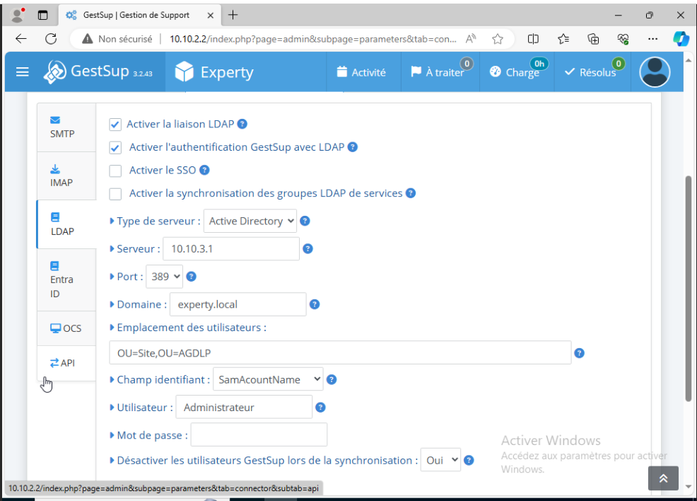

# Mise en place du server GestSup

## Installation Automatique:

Sur une machine linux, lancez la commande suivante:

```bash
apt install curl -y && curl -s https://gestsup.fr/install.deb12.sh | bash
```

Et suivre les étapes.

## Installation Manuelle

### MISE À JOUR SYSTÈME

`apt update && apt upgrade -y && apt dist-upgrade -y`

### INSTALLATION DES PRÉREQUIS

`apt install apache2 mariadb-server unzip curl ntp -y`

### INSTALLATION PHP

```bash
apt install php libapache2-mod-php -y
apt install php-{common,curl,gd,imap,intl,ldap,mbstring,mysql,xml,zip} -y
```

### CRÉATION UTILISATEUR DE BASE DE DONNÉES

`mariadb -u root`

```bash
CREATE USER 'gestsup'@'localhost' IDENTIFIED BY 'password';
GRANT ALL PRIVILEGES ON *.* TO 'gestsup'@'localhost';
FLUSH PRIVILEGES;
exit
```

### SÉCURISATION MARIADB

`mysql_secure_installation`

Répondre y aux questions

### MODIFICATION DES PARAMÈTRES PHP

Éditer le fichier de configuration PHP

`nano /etc/php/8.2/apache2/php.ini`

Modifier les valeurs suivantes

```
max_execution_time = 480
memory_limit = 512M
upload_max_filesize = 8M
date.timezone = Europe/Paris
```

### MODIFICATION DES PARAMÈTRES MARIADB

Éditer le fichier de configuration MariaDB

`nano /etc/mysql/mariadb.conf.d/50-server.cnf`

Ajouter la valeur suivante dans la section [mysqld] (la valeur doit être au minimum à 25% de la capacité en RAM du serveur)

`innodb_buffer_pool_size = 1G`

Ajouter la valeur suivante dans la section [mysqld]

`skip-name-resolve`

### TÉLÉCHARGER GESTSUP

`wget -P /var/www/html https://gestsup.fr/downloads/versions/current/version/gestsup_3.2.X.zip`

### EXTRAIRE LES FICHIERS

`unzip /var/www/html/gestsup_3.2.X.zip -d /var/www/html`

### SUPPRESSION DES FICHIERS INUTILES

```bash
rm /var/www/html/gestsup_3.2.X.zip
rm /var/www/html/index.html
```

### MODIFIER LES DROITS POUR L'INSTALLATION
```bash
adduser gestsup --ingroup www-data
chown -R gestsup:www-data /var/www/html/
find /var/www/html/ -type d -exec chmod 750 {} \;
find /var/www/html/ -type f -exec chmod 640 {} \;
chmod 770 -R /var/www/html/upload
chmod 770 -R /var/www/html/images/model
chmod 770 -R /var/www/html/backup
chmod 770 -R /var/www/html/_SQL
chmod 660 /var/www/html/connect.php
```
### REDÉMARRAGE DU SERVEUR

`reboot`

## Configuration de LDAP

Se connecter, changer le mot de passe, puis configurer LDAP:

