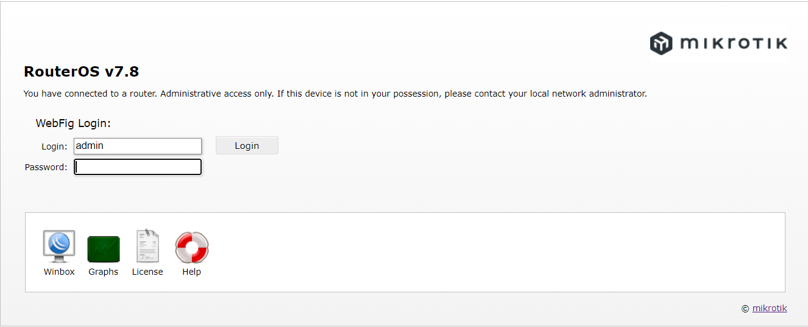
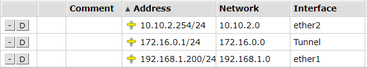
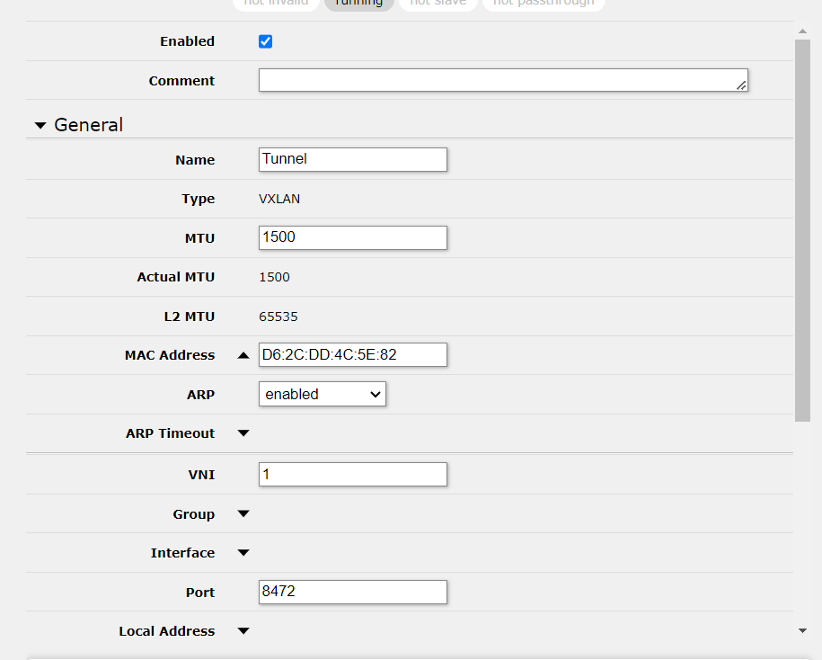
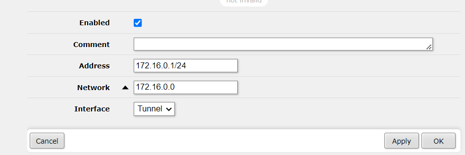
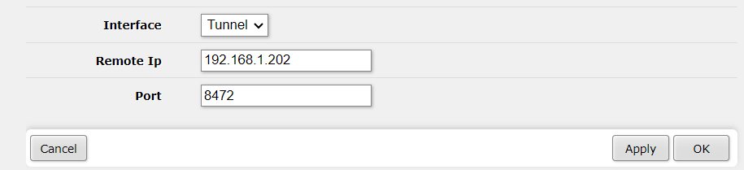
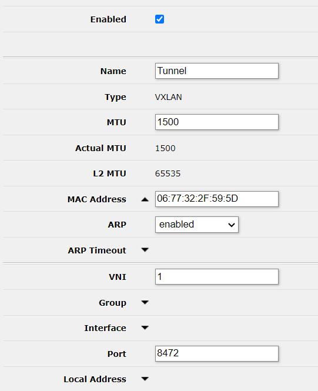
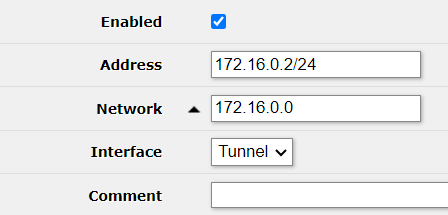
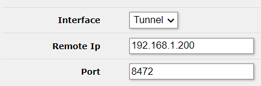
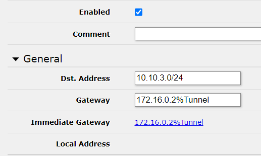
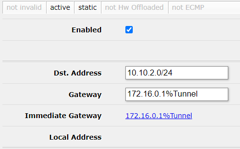

# Configuration du routeur MikroTik

## Introduction

Cette documentation vous guidera à travers le processus de configuration d'un routeur MikroTik, en mettant en place les paramètres suivants :

- **IP LAN :** 10.10.2.254/24
- **IP WAN :** 192.168.1.200/24

## Étape 1 : Connexion au routeur

Assurez-vous d'être connecté au routeur MikroTik via un navigateur Web en utilisant l'adresse IP par défaut (192.168.88.1). Connectez-vous avec les informations d'identification appropriées.

## Étape 2 : Configuration de l'interface WAN

1. Dans le menu de gauche, accédez à **IP** > **Addresses**.
2. Localisez l'interface WAN (généralement ether1) et configurez l'adresse IP WAN comme suit :
   - **Adresse IP :** 192.168.1.200/24
   - **Passerelle par défaut :** 192.168.1.1
   - **Masque de sous réseau :** 255.255.255.0

## Étape 3 : Configuration de l'interface LAN

1. Dans le menu de gauche, accédez à **IP** > **Addresses**.
2. Localisez l'interface WAN (généralement ether1) et configurez l'adresse IP WAN comme suit :
   - **Adresse IP :** 10.10.2.254/24
   - **Masque de sous réseau :** 255.255.255.0

## Étape 4 : Vérification

## Étape 5: Mise en place du tunnel VXLAN

Le VXLAN permet de lié plusieurs réseau entre eux via un tunnel à état de liens(il permettra d'utiliser certains protocoles de routage dynamique dans le future quand plusieurs régions seront ajoutés.)

Ici le tunnel sera mit en place enter 2 routers.

### Router 1 :

- Créer une interface VXLAN

P.S. le VNI correspond à l'id du tunnel (à la même façon qu'un VLAN ID)

- Attribution de l'IP du tunnel:

Le VXLAN encapsule des packets L2 dans des packet L4, une interface VXLAN à donc besoin d'une address IP pour pouvoir router les packets.

- Ajout du VTEP: 

Un VTEP est un endpoint VXLAN, entre autre, l'autre bout du tunnel.

P.S. Un tunnel VXLAN peut posseder plusieurs endpoints, ont peut donc avoir 1 interface pour plusieurs autres router.

### Router 2 :

- Créer une interface VXLAN

- Attribution de l'IP du tunnel:

- Ajout du VTEP: 

Un VTEP est un endpoint VXLAN, entre autre, l'autre bout du tunnel.

### Routage :

Pour router les packets via le tunnel VXLAN nous devons rajouters des routes pour dire au packets quel chemin prendre pour atteindre un subnet étant sur l'un ou l'autre router.

- Router 1:

P.S. le signe `%` force le passage sur l'interface spécifié après le signe.

- Router 2:

