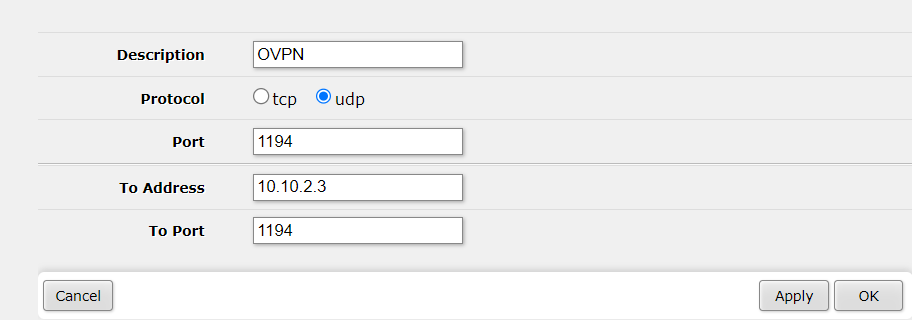

# Configuration d'un serveur OpenVPN

## Installation

Sur un server linux, executer la commande suivante:

`wget https://git.io/vpn -O openvpn-install.sh && bash openvpn-install.sh`

Puis suivre les étapes.

## Accessibilité

Pour rendre le serveur OpenVPN accessible depuis le réseau WAN, il faut proceder à l'ouverture du port depuis le router.

Dans le menu "QuickSet" > "Port mapping":

